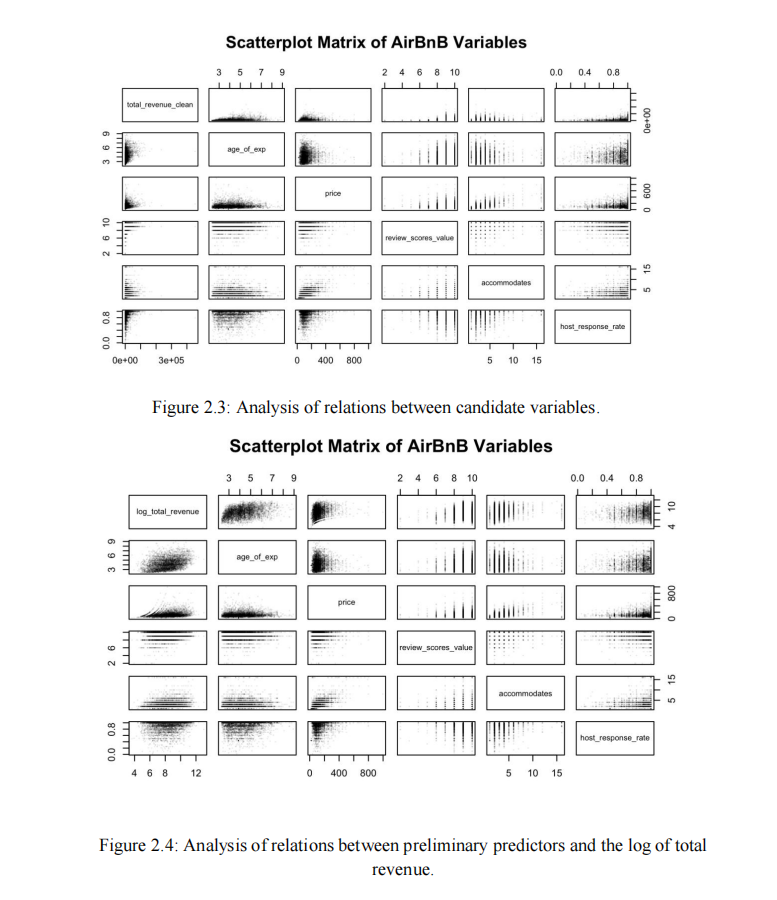

# Airbnb Revenue Analysis and Prediction

Statistical and econometric modeling of Airbnb listing performance using multiple linear regression, diagnostic analysis, and model selection techniques.

---

# Overview

This project investigates the determinants of Airbnb revenue using statistical and econometric modeling techniques. The analysis examines how pricing strategies, host experience, customer review scores, room type, accommodation capacity, and host responsiveness influence Airbnb revenue.

Using multiple linear regression alongside diagnostic testing and model selection procedures, this project aims to identify statistically significant predictors of Airbnb revenue and evaluate model performance in a real-world business context.

---

# Research Question

Which factors most strongly influence Airbnb revenue?

Can statistical modeling help Airbnb hosts optimize pricing and operational decisions?

---

# Dataset

Source:
- GAAirBnB Dataset (Cannata, 2017)

Observations:
- 5702 Airbnb listings from the Netherlands

Key Variables:
- Total revenue
- Price
- Host experience
- Review scores
- Accommodates
- Host response rate
- Room type
- Host response time

---

# Methodology

## Statistical Methods
- Multiple Linear Regression (MLR)
- Logarithmic transformation
- Residual diagnostics
- Partial F-tests
- Variance Inflation Factor (VIF)
- AIC/BIC model selection
- 10-fold cross validation

## Feature Engineering
- Log transformation of skewed variables
- Square-root transformation
- Dummy variable encoding for categorical predictors

---
# Selected Visualizations

# Key Findings

- Host experience showed the strongest positive relationship with revenue.
- Shared-room listings generated significantly lower revenue compared to entire-home listings.
- Faster host responsiveness was associated with improved revenue performance.
- Price elasticity analysis suggested relatively inelastic Airbnb demand.
- Customer review scores positively influenced listing revenue.

---

# Model Performance

Final Model Metrics:
- R² = 0.224
- Adjusted R² = 0.223

The final model explains approximately 22% of the variation in log-transformed Airbnb revenue, which is considered reasonable for social science and behavioral datasets.

# Airbnb Revenue Analysis and Prediction

Statistical and econometric modeling of Airbnb listing performance using multiple linear regression, diagnostic analysis, and model selection techniques.

---
# Full Report

The complete statistical report can be found in:
/report/

# Technologies Used

R
ggplot2
dplyr
caret
car
stats

# Author

Cruise Chen
University of Toronto
Statistics, Mathematics, and Economics

